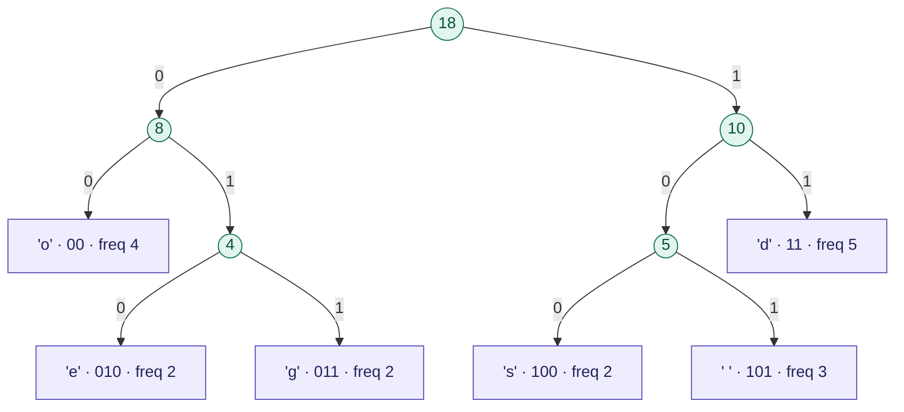

# Computer Science: Not A Beginner's Guide

> **Nile University — School of Information Technology & Computer Science**
> Open House · Summer 2026

---

## 👥 Presented By

| | Name | Role |
|---|---|---|
| 🎓 | **Rehab** | Core CS & Programming |
| 🎓 | **Salma** | Core CS & Programming |
| 🎓 | **Ahmed Khaled** | Algorithms & Data Structures |

---

## 🗺️ What This Session Covers

This is **not** an intro to "what is a computer." We go straight to the ideas that separate people who *use* computers from people who *master* them.

Three pillars of core Computer Science:

```
Programming  ──────  Algorithms  ──────  Data Structures
    │                    │                      │
 "make it work"     "make it fast"        "make it small"
```

---

## ⚡ Part 1 — Algorithm Genius: The Fibonacci Speed Problem

### The Sequence

You've probably seen it before:

```
0, 1, 1, 2, 3, 5, 8, 13, 21, 34, 55, 89 ...
```

Every number is the sum of the two before it. Simple rule. So computing it should be simple too — right?

### Two Ways to Solve It

#### 🐢 Naive Recursive (the obvious way)

```python
def fib_naive(n):
    if n <= 1:
        return n
    return fib_naive(n - 1) + fib_naive(n - 2)
```

This looks clean. But every call spawns **two more calls**, which each spawn two more, which each spawn two more...

#### 🚀 Array-Based (the smart way)

```python
def fib_array(n):
    if n <= 1:
        return n
    dp = [0] * (n + 1)
    dp[1] = 1
    for i in range(2, n + 1):
        dp[i] = dp[i - 1] + dp[i - 2]
    return dp[n]
```

Store each answer once. Never recompute. Done.

### The Dramatic Difference

**Live demo result at n = 35:**

| Approach | Time |
|---|---|
| Naive recursive | ~1 second |
| Array-based | ~0.000017 seconds |
| **Speedup** | **~58,000×** |

### What Happens as n Grows?

The naive approach has **exponential** time complexity — O(2ⁿ). Here is what that means in real time on a moderate computer:

| n | Estimated Runtime |
|---|---|
| 35 | ~1 second |
| 40 | ~11 seconds |
| 50 | ~23 minutes |
| 60 | ~2 days |
| 70 | ~8 months |
| **75** | **~7 years** 🔴 |
| 80 | ~80 years |

> The array-based solution solves **n = 75 in microseconds.**
> The naive solution would still be running by the time you graduate, work 3 years, and retire.

**That is not a hardware problem. That is an algorithm problem.**

---

## 🗜️ Part 2 — Data Structure Genius: The Huffman Storage Problem

### The Problem

Every character on your computer is stored using **8 bits** — whether it's a rare `z` or a common `e`. That's treating all characters equally, regardless of how often they appear. Wasteful.

**What if we gave shorter codes to common characters, and longer codes to rare ones?**

That is exactly what David Huffman figured out in 1952. It's used today in ZIP files, JPEG images, and MP3 audio.

### Working Example

Take the string: `"dogs do good deeds"`

Character frequencies:

| Char | Frequency | Huffman Code | Bits (standard) | Bits (Huffman) | Saved per char |
|---|---|---|---|---|---|
| `'d'` | 5 | `11` | 8 | 2 | **6 bits** |
| `'o'` | 4 | `00` | 8 | 2 | **6 bits** |
| `' '` | 3 | `101` | 8 | 3 | **5 bits** |
| `'e'` | 2 | `010` | 8 | 3 | **5 bits** |
| `'g'` | 2 | `011` | 8 | 3 | **5 bits** |
| `'s'` | 2 | `100` | 8 | 3 | **5 bits** |

**Result:**

```
Original   : 144 bits  (18 chars × 8 bits)
Compressed :  45 bits
Saved      :  99 bits  →  68.8% smaller
```

### The Huffman Coding Tree

The codes are not chosen randomly — they emerge from building a **binary tree** where the most frequent characters end up closest to the root (shortest path = fewest bits).

Read it like a map: follow `0` for left, `1` for right. Where you land is the character's code.



> `'d'` appears most — it sits closest to the root, just 2 steps away → code `11`
> `'e'` appears least — it sits deeper, 3 steps away → code `010`
> **Frequent = short code. Rare = longer code. That's the entire idea.**

### The Code

```python
import heapq

class Node:
    def __init__(self, char, freq):
        self.char = char
        self.freq = freq
        self.left = self.right = None

    def __lt__(self, other):
        return self.freq < other.freq

def build_tree(text):
    freq = {}
    for ch in text:
        freq[ch] = freq.get(ch, 0) + 1

    heap = [Node(ch, f) for ch, f in freq.items()]
    heapq.heapify(heap)

    while len(heap) > 1:
        left  = heapq.heappop(heap)
        right = heapq.heappop(heap)
        parent = Node(None, left.freq + right.freq)
        parent.left, parent.right = left, right
        heapq.heappush(heap, parent)

    return heapq.heappop(heap)

def get_codes(node, prefix="", codes={}):
    if node.char is not None:
        codes[node.char] = prefix
    else:
        get_codes(node.left,  prefix + "0", codes)
        get_codes(node.right, prefix + "1", codes)
    return codes
```

---

## 🔑 Key Takeaways

| Concept | Naive Thinking | CS Genius |
|---|---|---|
| **Algorithm** | Solve it any way that works | Choose *how* you solve it — speed is a design decision |
| **Data Structure** | Store everything equally | Organize data to match how it's actually used |
| **Impact** | n=75 takes 7 years | n=75 takes microseconds |
| **Impact** | 144 bits for 18 chars | 45 bits — 68.8% smaller |

---

## 📁 Repository Structure

```
├── fibonacci.py      # Naive vs array-based Fibonacci with live timing
├── huffman.py        # Huffman encoding with full compression stats
└── README.md
```

---

## 🚀 Run It Yourself

```bash
python3 fibonacci.py
python3 huffman.py
```

No dependencies. Pure Python. Just clone and run.

---

## 🏛️ About

**Nile University** · School of Information Technology and Computer Science

*Open House Summer 2026 — introducing Computer Science to incoming students through real ideas, live code, and the kind of problems that make you think differently.*
